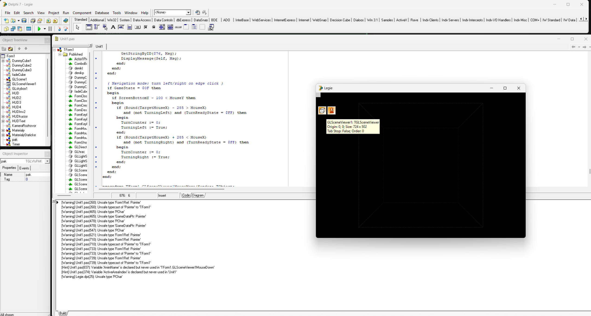

# LEGIE decomp

WIP matching decomp of [LEGIE 2009](https://cs.wikipedia.org/wiki/Legie_(po%C4%8D%C3%ADta%C4%8Dov%C3%A1_hra)).



## Info

- Borland Delphi 7 (Object Pascal)
- FMOD 3.75
- GLScene 1.0.0.0714
- `legie.exe` is packed with UPX; unpacked binary is `legie_unpacked.exe`
- Data files: `legie.sud` / `demo.sub` (custom PACK format)
  - TGA, JPEG, BMP textures
  - OGG audio (music, dialogue, SFX)
  - MD2, 3DS models (use Noesis; two models exceed 2k verts)
  - `_prulet.txt` cutscene scripts (debugging leftover)

## Dev Environment

1. Install [Borland Delphi 7](https://dl.winworldpc.com/Borland%20Delphi%207.0%20Enterprise%20Edition%20(ISO).7z)
2. On first run, open the IDE empty, then `File -> Open` `glscene/Delphi7/GLScene7.dpk`, then `Compile -> Install`
3. Install Python 3.x, then `pip install -r requirements.txt`
4. Place `legie.sud` and `fmod.dll` in `bin/`

## Structure

```
src              Compilable project
raw_idr          Interactive Delphi Reconstructor output
analysis         Take a guess..
tools            Python tooling
bin              "playable" game
pak_extracted    Extracted game assets (see unpack_sud.py)
glscene          GLScene 1.0.0.0714 source
fmod-3.75        FMOD 3.75 API
```

## Decompilation Workflow

This project uses a matching-decomp approach: write Pascal code that compiles to identical assembly as the original binary, verified function-by-function.

### 1. Pick a function

Check what needs work:

```bash
python tools/progress.py # show match status for all functions
python tools/annotate_funcs.py --missing # list functions not yet in source
```

Start with small functions (fewer instructions = easier to match).

### 2. Read the original assembly

```bash
python tools/asm_differ.py 00561B60 # by original address
python tools/asm_differ.py --list # see all functions with addresses
```

Or read the IDR output directly in `raw_idr/Unit1.pas` -- search for the address. Each function has its full x86 assembly inside `{* *}` comment blocks with IDR annotations for strings, global variables, and call targets.

### 3. Write the Pascal implementation

Edit `src/UnitX.pas`. Add or replace the function body. Annotate it with the original address:

```pascal
procedure MyFunction; { 00561B60 }
begin
  // decompiled code here
end;
```

The `{ XXXXXXXX }` comment links the function to its original for diffing.

### 4. Build and diff

```bash
python tools/build.py --diff MyFunction   # compile + diff in one step
python tools/build.py                     # just compile
python tools/asm_differ.py MyFunction     # just diff (no recompile)
```

The differ shows a side-by-side comparison with color:
- **Green (OK)**: instruction matches
- **Yellow (OPS)**: mnemonic matches, operands differ
- **Red (DIFF)**: mnemonic mismatch
- **Cyan (REC+)**: extra instruction in recompiled (often alignment padding)

### 5. Iterate until matching

Fix discrepancies shown by the differ. Common issues:
- Wrong variable types (e.g., `Byte` vs `Integer` changes register size `al` vs `eax`)
- Wrong calling convention or parameter order
- Missing `var` parameter (pass-by-reference vs pass-by-value)
- Compiler generating different control flow for equivalent logic
- String literals at wrong addresses (check ordering in source)

### 6. Track progress

```bash
python tools/progress.py --report    # full report, saves to analysis/
python tools/build.py --diff-all     # build + show all function status
```

### Useful one-off commands

```bash
# Re-extract original assembly (after updating raw_idr files)
python tools/extract_asm.py

# Unpack game data for reference
python tools/unpack_sud.py legie.sud pak_extracted

# Check which functions lack address annotations
python tools/annotate_funcs.py

# Generate function address mapping file
python tools/annotate_funcs.py --gen-map
```

## License

This project is licensed under the MIT license.